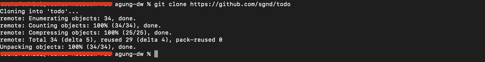
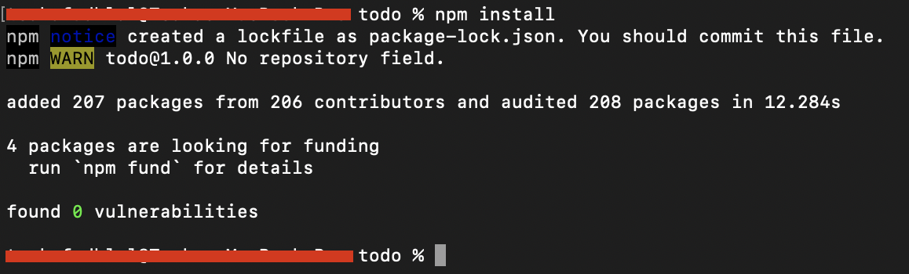
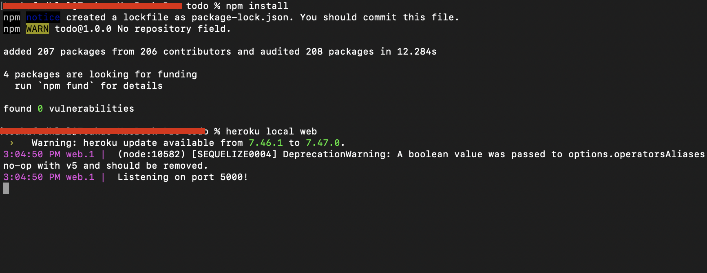
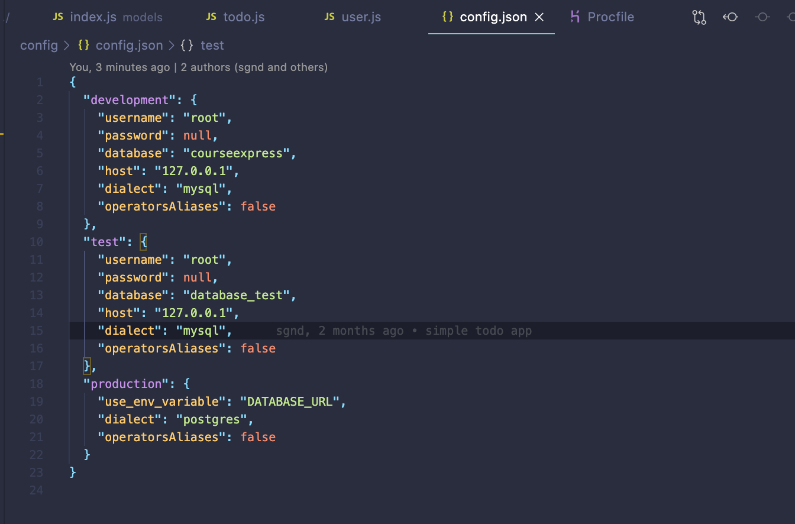
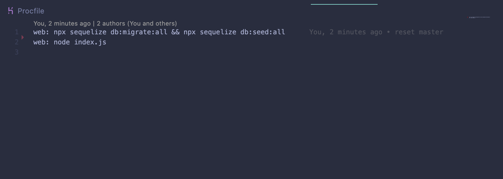
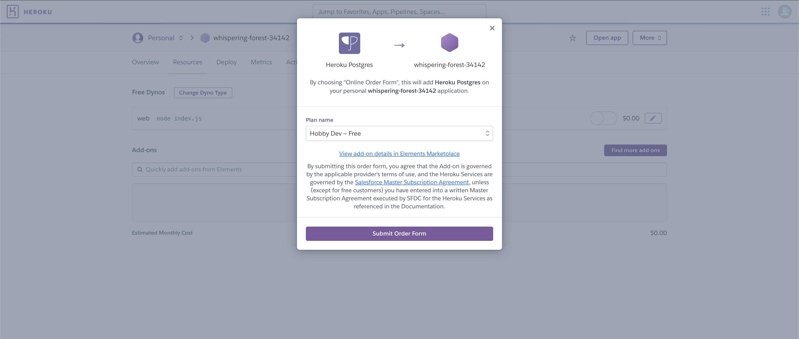
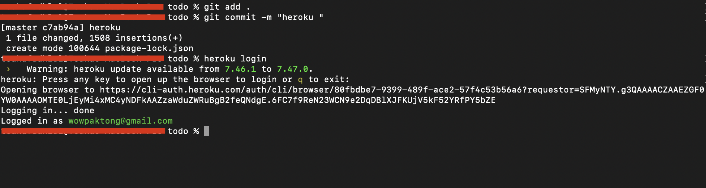
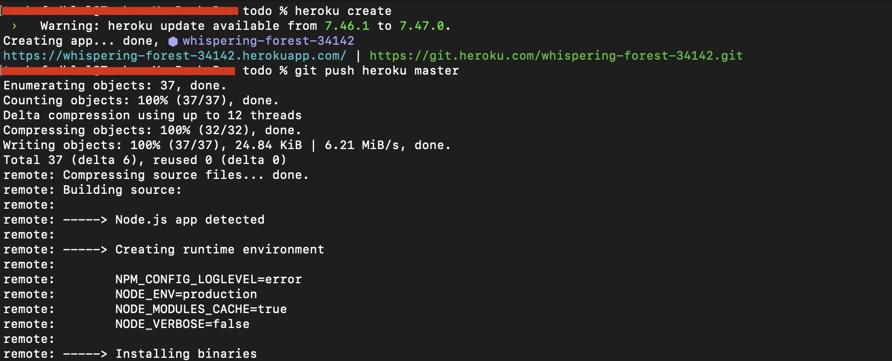

1. Clone Project
  
2. Install Dependencies
  
3. Try heroku local deploy
  
4. Change Production env
   
5. Change Pocfile
   
6. Order Heroku Postgresql
   
7. Git add and Git commit then Heroku login
  
8. Heroku Create then Heroku Push to master repository
  